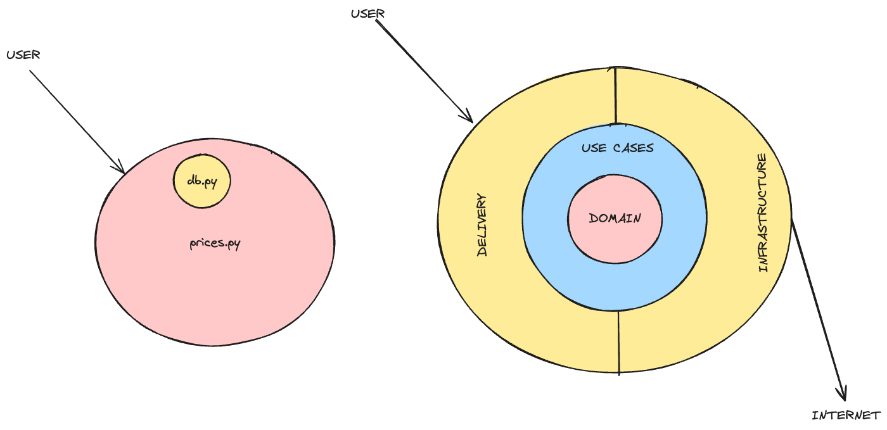

# Lift pass pricing

## Ports and Adapters

This application solves the problem of calculating the pricing for ski lift passes.
There's some intricate logic linked to what kind of lift pass you want, your age
and the specific date at which you'd like to ski. There's a new feature request,
be able to get the price for several lift passes, not just one. Currently the pricing
for a single lift pass is implemented, unfortunately the code as it is designed
is ***not reusable***.
You could put some high level tests in place in order to do ***preparatory refactoring***
so that the new feature requires minimum effort to implement.

This kata models a common problem - code that makes no sense to unit test due to bad design.

You can find a [video pitch here](http://youtube.com/watch?v=-gSyD60WAvc)

## When am I done?

There are a few steps, you could do any of them.

1. Cover with high level tests.
1. Refactor the code to maximize unit testability and reuse for the new feature
1. Pull down most of the high level tests
1. Implement the new feature using unit tests and 1 or 2 high level tests.

## Installation

Set up a MySQL database on localhost 3306 with user `root` and password `mysql`.
If you have Docker installed the easiest thing is to use this script, that will initialize a [MariaDB](https://mariadb.org/).

    ./runLocalDatabase.sh

Inject the data with

    mysql -u root -p mysql < ./database/initDatabase.sql

Then head on to the language of your choice and follow the Readme in there.
Some of the languages have a failing test that you could finish writing.

## Tips

There's a good chance you could find a design that is both easier to test, faster to
work with and that solves the problem with minimum amount of code. One such design
would be to rid the bulk of the logic from it's adherence to the http/rest framework
and from the sql specificities. This is sometimes called **hexagonal architecture**
and it facilitates respecting the ***Testing Pyramid*** which is not currently
possible - there can be only top-level tests

The typical workflow would be

1. Cover everything from the http layer, use a real DB
1. Separate request data extraction and sending the response from the logic
1. Extract a method with the pure logic, move that method to an object (ex PricingLogic)
1. Now extract the sql stuff from PricingLogic, first to some method with a signature that has nothing to do with sql, then move these methods to a new class (ex PricingDao)
1. There should be ~3/4 elements, the http layer should have the PricingLogic as an injected dependency and the PricingLogic should have the PricingDao as an injected dependency.
1. Move the bulk of the high level tests down onto PricingLogic using a fake dao, write some focused integration tests for the PricingDao using a real DB, there should be only a handful.

Now the HTTP layer and the integration of the parts can be tested with very few (one or two) high-level tests.

## CONTRIBUTING

There are two branches, the master branch and the with_tests branch. The master is always merged into the with_tests branch. 
So typically if you want to contribute a new language or a *simple* version of a language you typically change the master branch, 
then switch to the with_tests branch and  merge with  master, then add tests. 

Note that there are github actions for most of the with_tests versions, please do provide one if you add a language. This allows
anyone having trouble running the tests with a baseline for getting the tests to work

When you're ready please submit one pull request for each branch

Thanks for contributing!
